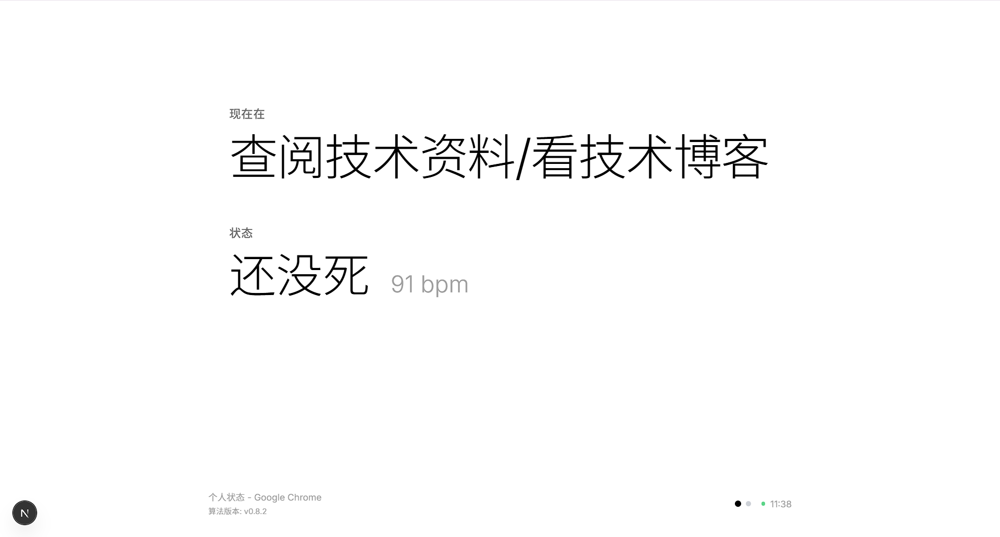

  
  # i

  一个个人状态展示页面

  <br />
  
  

  

  <br />

  ## 快速启动

  请先确保你安装了   [Node.js](https://nodejs.org/en/download/) / [pnpm](https://pnpm.io/installation)


  ```bash
  git clone https://github.com/Shuakami/i.git
  cd i
  pnpm install
  ```

  <br />

  ```bash
  pnpm dev
  ```

  <br />

  ## 相关项目

| 项目 | 平台 | 描述 |
|---|---|---|
| [i](https://github.com/shuakami/i) (本仓库) | Web | 一个个人状态实时展示页面 |
| [windows-activity-collector](https://github.com/shuakami/windows-activity-collector) | Windows | 采集 Windows 上的窗口及进程活动数据 |
| [BridgeBeat](https://github.com/shuakami/BridgeBeat) | Android | 桥接 BLE 心率设备数据到服务端的安卓应用 |
| [WristInPeace](https://github.com/shuakami/WristInPeace) | WearOS | 在手表上作为 BLE 服务端广播心率数据的应用 |


  