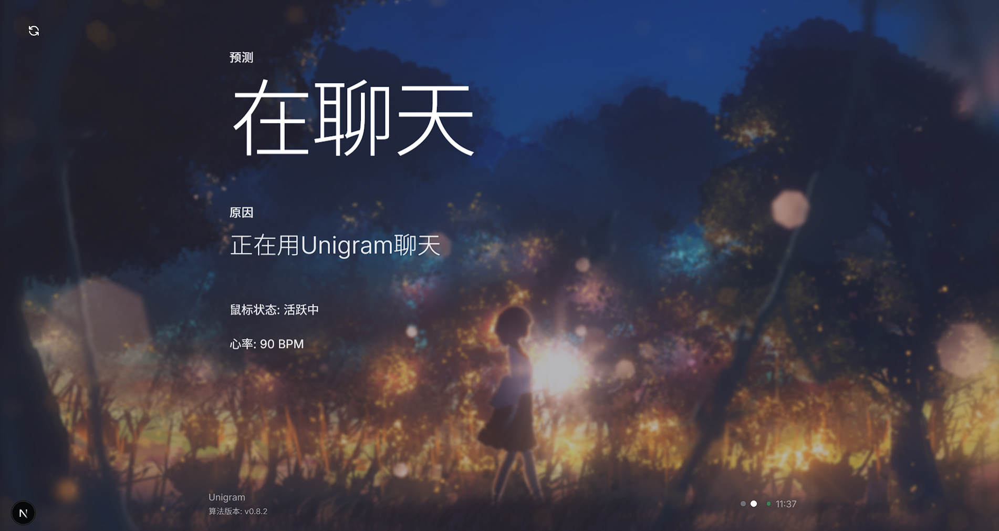

  
  # i

  一个个人状态展示页面

  <br />
  
  

  

  <br />

  ## 快速启动

  请先确保你安装了   [Node.js](https://nodejs.org/en/download/) / [pnpm](https://pnpm.io/installation)


  ```bash
  git clone https://github.com/Shuakami/i.git
  cd i
  pnpm install
  ```

  <br />

  ```bash
  pnpm dev
  ```

  <br />

  ## 相关项目